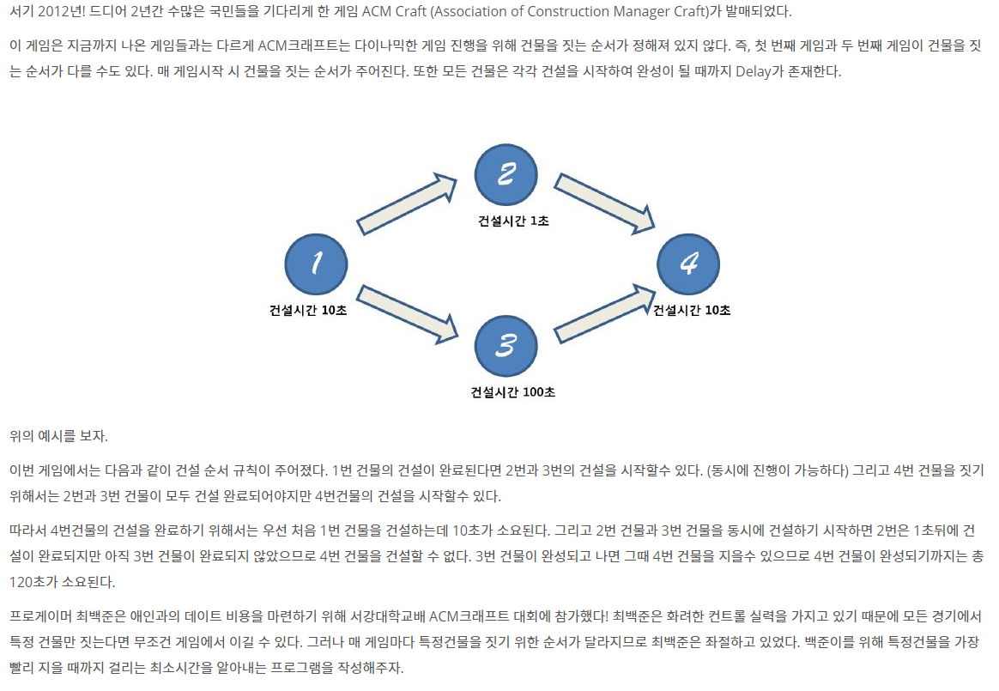

# 📄 치즈 

## 출처
https://www.acmicpc.net/problem/1005

## 조건
|시간 제한|	메모리 제한|
|:----:|:------:|
|1 초 |	512 MB|

## 문제

## 입력
첫째 줄에는 테스트케이스의 개수 T가 주어진다. 각 테스트 케이스는 다음과 같이 주어진다. 첫째 줄에 건물의 개수 N 과 건물간의 건설순서규칙의 총 개수 K이 주어진다. (건물의 번호는 1번부터 N번까지 존재한다) 

둘째 줄에는 각 건물당 건설에 걸리는 시간 D가 공백을 사이로 주어진다. 셋째 줄부터 K+2줄까지 건설순서 X Y가 주어진다. (이는 건물 X를 지은 다음에 건물 Y를 짓는 것이 가능하다는 의미이다) 

마지막 줄에는 백준이가 승리하기 위해 건설해야 할 건물의 번호 W가 주어진다.

## 출력
건물 W를 건설완료 하는데 드는 최소 시간을 출력한다. 편의상 건물을 짓는 명령을 내리는 데는 시간이 소요되지 않는다고 가정한다.

건설순서는 모든 건물이 건설 가능하도록 주어진다.
