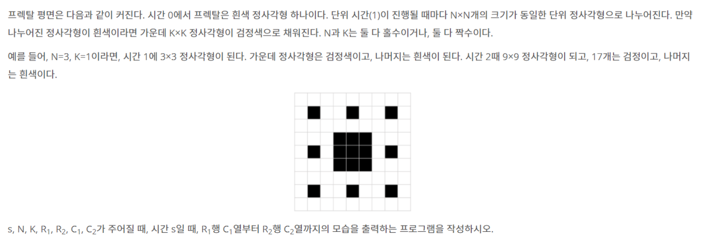

# 📄 프렉탈 평면

## 출처
https://www.acmicpc.net/problem/1030

## 조건
|시간 제한|	메모리 제한|
|:----:|:------:|
|2 초 |	128 MB|

## 문제

## 입력
첫째 줄에 7개의 정수 s, N, K, R1, R2, C1, C2가 주어진다.

## 출력
첫째 줄에 문제의 정답을 출력한다. 첫째 줄에 R1행의 모습을 출력하고 이런 식으로 총 R2-R1+1개의 줄에 출력하면 된다. 각 행의 모습을 출력할 때, C1열부터 C2열까지 차례대로 흰색이면 숫자 '0' 검정이면 숫자 '1'을 출력한다. 숫자 사이에 공백을 넣으면 안 된다.
