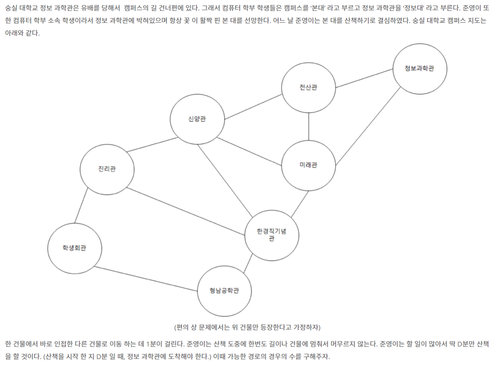

# 📄 본대 산책2

## 출처
https://www.acmicpc.net/problem/12850

## 조건
|시간 제한|	메모리 제한|
|:----:|:------:|
|1 초 |	512 MB|

## 문제

## 입력
D 가 주어진다 (1 ≤ D ≤ 1,000,000,000) 

## 출력
가능한 경로의 수를 1,000,000,007로 나눈 나머지를 출력한다.
