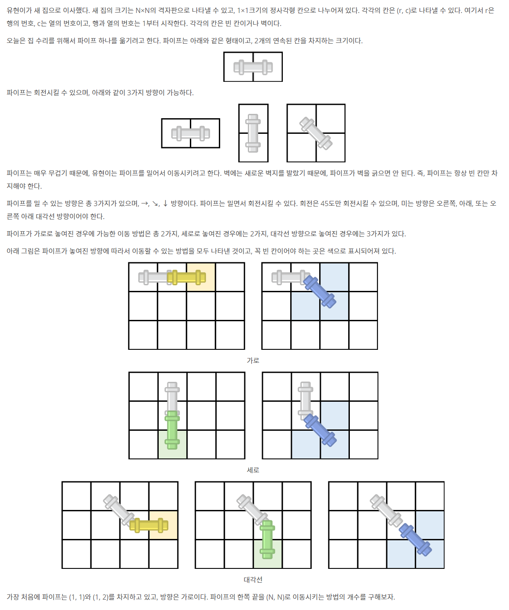

# 📄 파이프 옮기기 1

## 출처
https://www.acmicpc.net/problem/17070

## 조건
|시간 제한|	메모리 제한|
|:----:|:------:|
|1 초 (추가 시간 없음)|	512 MB|

## 문제

## 입력
첫째 줄에 집의 크기 N(3 ≤ N ≤ 16)이 주어진다. 둘째 줄부터 N개의 줄에는 집의 상태가 주어진다. 빈 칸은 0, 벽은 1로 주어진다. (1, 1)과 (1, 2)는 항상 빈 칸이다.

## 출력
첫째 줄에 파이프의 한쪽 끝을 (N, N)으로 이동시키는 방법의 수를 출력한다. 이동시킬 수 없는 경우에는 0을 출력한다. 방법의 수는 항상 1,000,000보다 작거나 같다.

