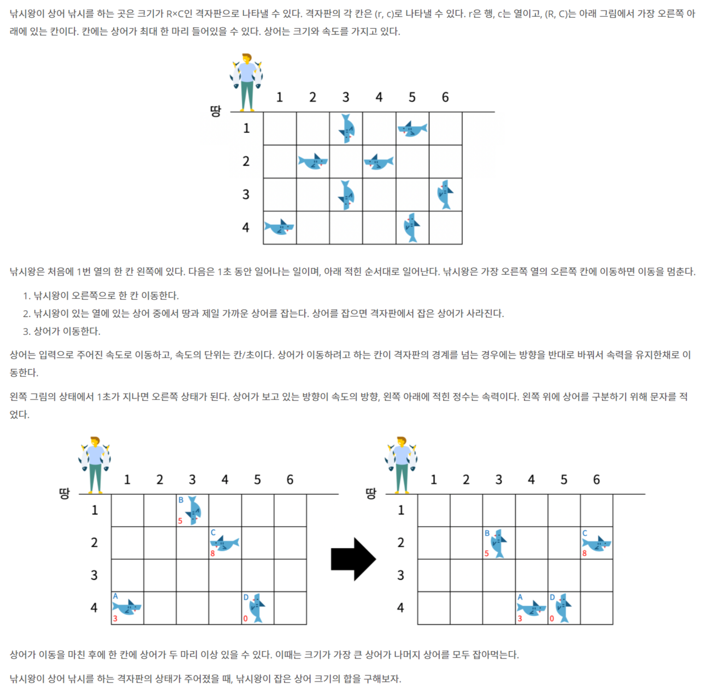

# 📄 낚시왕

## 출처
https://www.acmicpc.net/problem/17143

## 조건
|시간 제한|	메모리 제한|
|:----:|:------:|
|1 초 |	512 MB|

## 문제

## 입력
첫째 줄에 격자판의 크기 R, C와 상어의 수 M이 주어진다. (2 ≤ R, C ≤ 100, 0 ≤ M ≤ R×C)

둘째 줄부터 M개의 줄에 상어의 정보가 주어진다. 상어의 정보는 다섯 정수 r, c, s, d, z (1 ≤ r ≤ R, 1 ≤ c ≤ C, 0 ≤ s ≤ 1000, 1 ≤ d ≤ 4, 1 ≤ z ≤ 10000) 로 이루어져 있다. (r, c)는 상어의 위치, s는 속력, d는 이동 방향, z는 크기이다. d가 1인 경우는 위, 2인 경우는 아래, 3인 경우는 오른쪽, 4인 경우는 왼쪽을 의미한다.

두 상어가 같은 크기를 갖는 경우는 없고, 하나의 칸에 둘 이상의 상어가 있는 경우는 없다.

## 출력
낚시왕이 잡은 상어 크기의 합을 출력한다.
