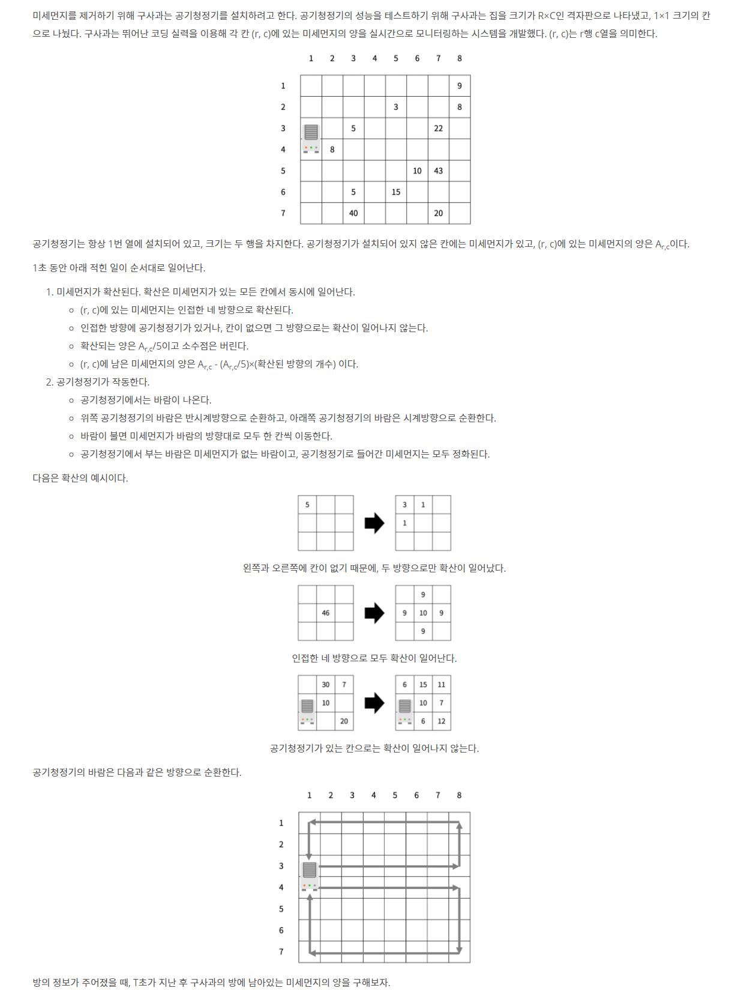

# 📄 미세먼지 안녕!

## 출처
https://www.acmicpc.net/problem/17144

## 조건
|시간 제한|	메모리 제한|
|:----:|:------:|
|1 초|	512 MB|

## 문제

## 입력
첫째 줄에 R, C, T (6 ≤ R, C ≤ 50, 1 ≤ T ≤ 1,000) 가 주어진다.

둘째 줄부터 R개의 줄에 Ar,c (-1 ≤ Ar,c ≤ 1,000)가 주어진다. 공기청정기가 설치된 곳은 Ar,c가 -1이고, 나머지 값은 미세먼지의 양이다. -1은 2번 위아래로 붙어져 있고, 가장 윗 행, 아랫 행과 두 칸이상 떨어져 있다.

## 출력
첫째 줄에 T초가 지난 후 구사과 방에 남아있는 미세먼지의 양을 출력한다.
