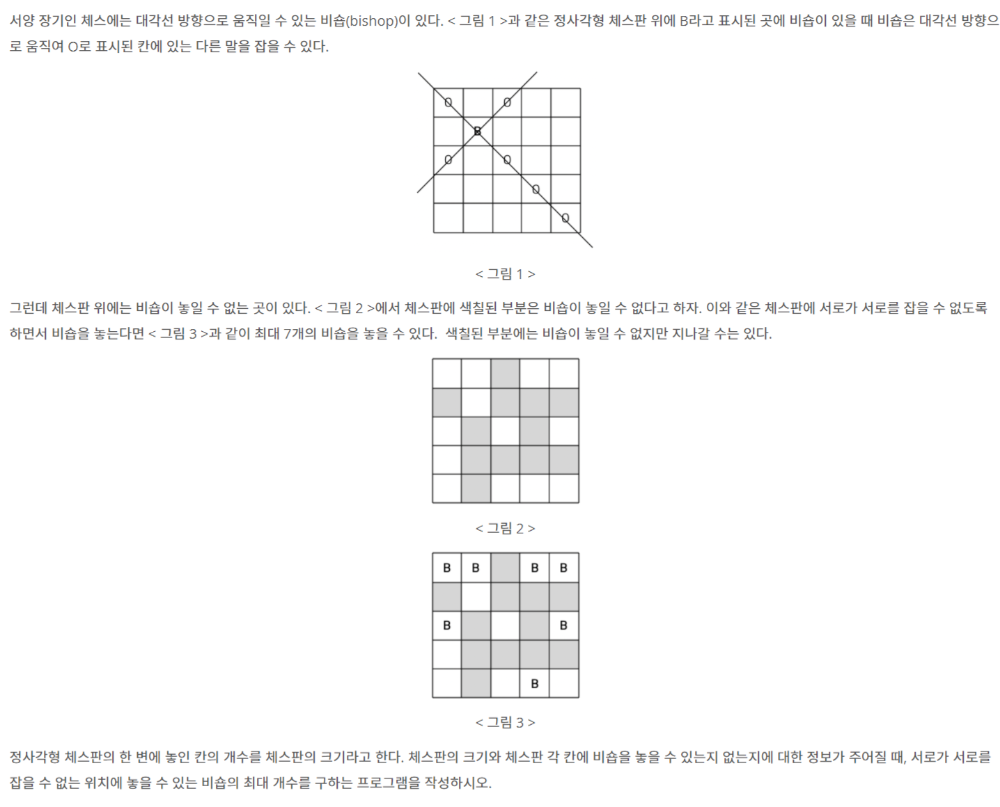

# 📄 비숍

## 출처
https://www.acmicpc.net/problem/1799

## 조건
|시간 제한|	메모리 제한|
|:----:|:------:|
|10 초 |	128 MB|

## 문제

## 입력
첫째 줄에 체스판의 크기가 주어진다. 체스판의 크기는 10이하의 자연수이다. 둘째 줄부터 아래의 예와 같이 체스판의 각 칸에 비숍을 놓을 수 있는지 없는지에 대한 정보가 체스판 한 줄 단위로 한 줄씩 주어진다. 비숍을 놓을 수 있는 곳에는 1, 비숍을 놓을 수 없는 곳에는 0이 빈칸을 사이에 두고 주어진다.

## 출력
첫째 줄에 주어진 체스판 위에 놓을 수 있는 비숍의 최대 개수를 출력한다.
