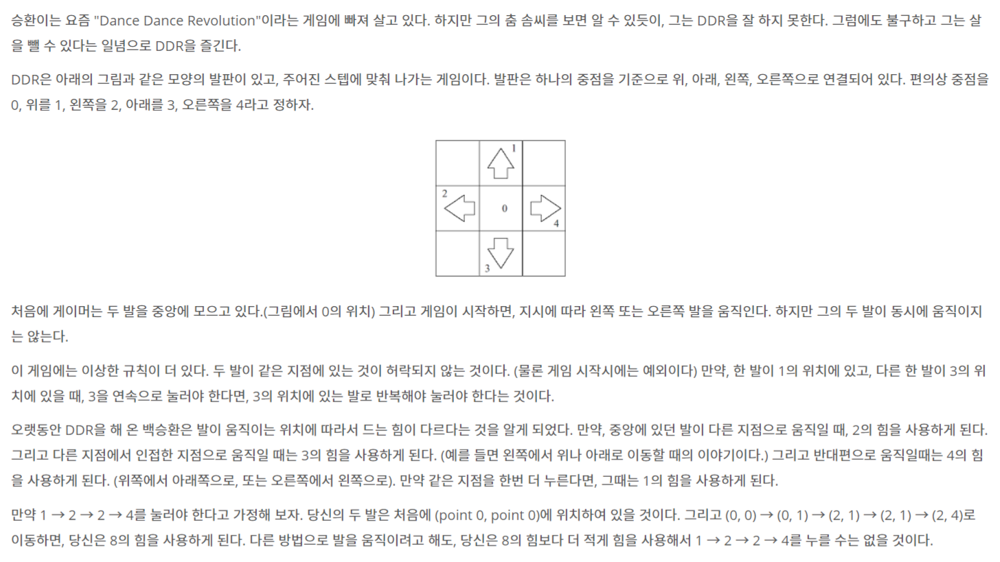

# 📄 Dance Dance Revolution 

## 출처
https://www.acmicpc.net/problem/2342

## 조건
|시간 제한|	메모리 제한|
|:----:|:------:|
|2 초 |	128 MB|

## 문제

## 입력
입력은 지시 사항으로 이루어진다. 각각의 지시 사항은 하나의 수열로 이루어진다. 각각의 수열은 1, 2, 3, 4의 숫자들로 이루어지고, 이 숫자들은 각각의 방향을 나타낸다. 그리고 0은 수열의 마지막을 의미한다. 즉, 입력 파일의 마지막에는 0이 입력된다. 입력되는 수열의 길이는 100,000을 넘지 않는다.

## 출력
한 줄에 모든 지시 사항을 만족하는 데 사용되는 최소의 힘을 출력한다.
