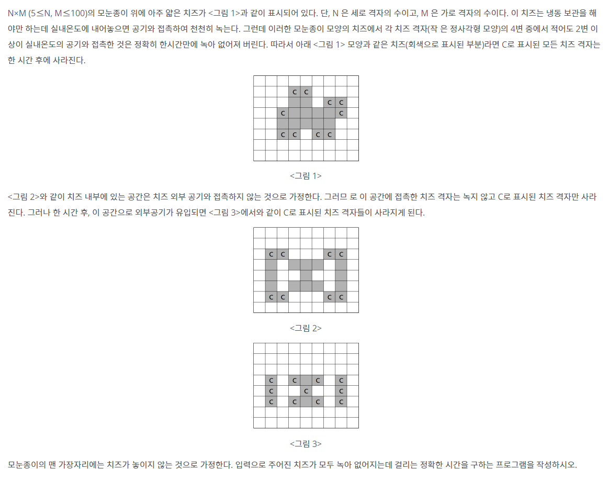

# 📄 치즈 

## 출처
https://www.acmicpc.net/problem/2638

## 조건
|시간 제한|	메모리 제한|
|:----:|:------:|
|1 초 |	128 MB|

## 문제

## 입력
첫째 줄에는 모눈종이의 크기를 나타내는 두 개의 정수 N, M (5 ≤ N, M ≤ 100)이 주어진다. 그 다음 N개의 줄에는 모눈종이 위의 격자에 치즈가 있는 부분은 1로 표시되고, 치즈가 없는 부분은 0으로 표시된다. 또한, 각 0과 1은 하나의 공백으로 분리되어 있다.

## 출력
출력으로는 주어진 치즈가 모두 녹아 없어지는데 걸리는 정확한 시간을 정수로 첫 줄에 출력한다.
