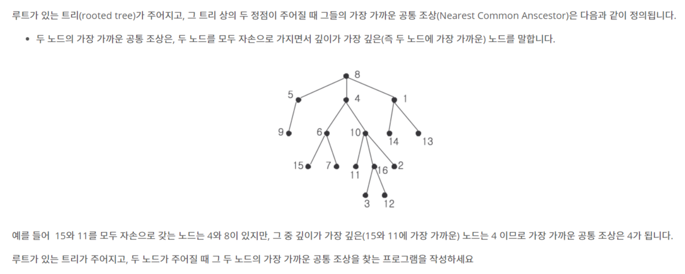

# 📄 가장 가까운 공통 조상

## 출처
https://www.acmicpc.net/problem/3584

## 조건
|시간 제한|	메모리 제한|
|:----:|:------:|
|1 초|	128 MB|

## 문제

## 입력
첫 줄에 테스트 케이스의 개수 T가 주어집니다.

각 테스트 케이스마다, 첫째 줄에 트리를 구성하는 노드의 수 N이 주어집니다. (2 ≤ N ≤ 10,000)

그리고 그 다음 N-1개의 줄에 트리를 구성하는 간선 정보가 주어집니다. 한 간선 당 한 줄에 두 개의 숫자 A B 가 순서대로 주어지는데, 이는 A가 B의 부모라는 뜻입니다. (당연히 정점이 N개인 트리는 항상 N-1개의 간선으로 이루어집니다!) A와 B는 1 이상 N 이하의 정수로 이름 붙여집니다.

테스트 케이스의 마지막 줄에 가장 가까운 공통 조상을 구할 두 노드가 주어집니다.

## 출력
각 테스트 케이스 별로, 첫 줄에 입력에서 주어진 두 노드의 가장 가까운 공통 조상을 출력합니다.
